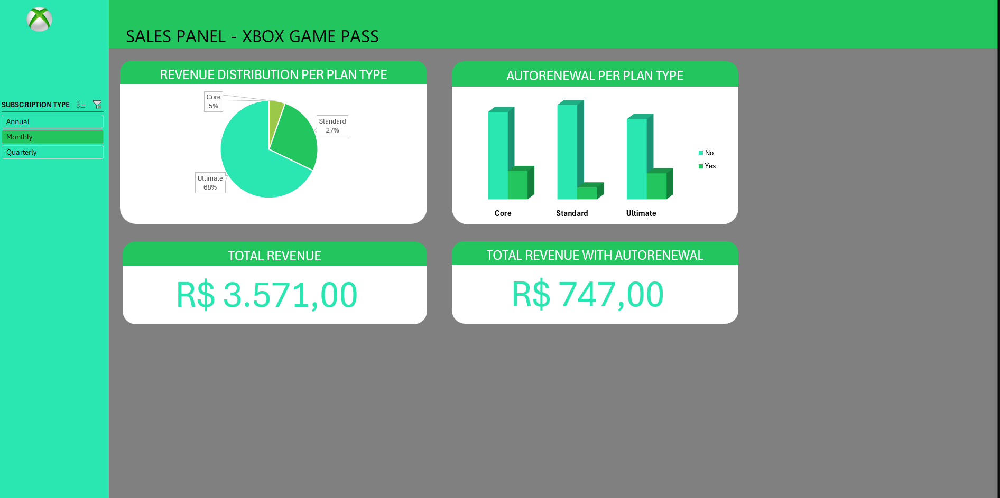

# Dashboard de Vendas – Xbox Game Pass

Projeto desenvolvido para análise dos dados de vendas do Xbox Game Pass, utilizando recursos avançados do Microsoft Excel para construção de dashboards interativos e visualmente atrativos.

## 📊 Descrição

Este projeto tem como objetivo apresentar, de forma clara e visual, os principais indicadores extraídos dos dados fornecidos de vendas do Xbox Game Pass. A análise foi realizada inteiramente no Excel, utilizando tabelas e gráficos dinâmicos, além das ferramentas de design integradas para construção do painel.

## 🛠️ Ferramentas Utilizadas

- **Microsoft Excel** (tabelas dinâmicas, gráficos dinâmicos, recursos de design)
- Dados fornecidos prontos para análise

## 📈 Indicadores Extraídos

- **Revenue Distribution per Plan Type:** Distribuição da receita por tipo de plano
- **Autorenewal per Plan Type:** Taxa de renovação automática por tipo de plano
- **Total Revenue:** Receita total
- **Total Revenue with Autorenewal:** Receita total considerando apenas planos com renovação automática

## 🖼️ Exemplos do Dashboard

## 🚀 Como visualizar

1. Faça o download do arquivo Excel disponível neste repositório.
2. Abra o arquivo no Microsoft Excel (versão 2016 ou superior recomendada).
3. Navegue pelas abas e interaja com os filtros e gráficos dinâmicos para explorar os dados.

## 💡 Aprendizados

- Construção de dashboards profissionais no Excel
- Análise visual de dados de vendas
- Utilização de tabelas e gráficos dinâmicos para extração de insights
- Aplicação de recursos de design para melhor apresentação dos resultados

## 📬 Contato

Fique à vontade para entrar em contato pelo [LinkedIn](https://www.linkedin.com/in/hugo-kersbaumer/) ou abrir uma issue neste repositório!

---